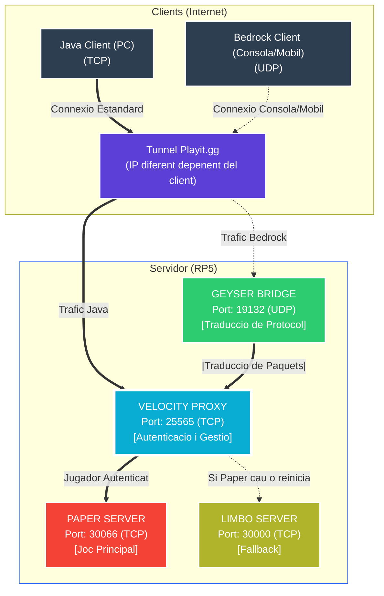

# PiBlock 

**Servidors Minecraft per a Instituts: Fàcil, Ràpid i complert**

---

## 📌 Què és això?

**PiBlock** és un sistema que converteix una petita **Raspberry Pi 5** en un servidor professional de Minecraft.

La seva màgia és que permet jugar a tothom, sense importar si tenen un ordinador potent (Java) o juguen des del mòbil o la consola (Bedrock). Tot està integrat i funciona automàticament.

---

## 🏗️ Com funciona tècnicament?

A sota pots veure exactament com viatgen les paquets des de els clients fins al servidor.

---
## Instalació

- --L'instalació automatica encara esta sent desenvolupada--
  
## 🚀 Com engegar-ho

Per a engegar-ho has d'anar a "https://piblock.cat/panel".

- Un cop en en panell has d'iniciar sessio amb les credencials que et proporcionem.
- Anar a l'apartat de servidors.
- Engegar manualment els 4 servidors.

---

## 👥 Equip de PiBlock

**Creat amb passió.**

    Distribuït sota <b>MIT License</b>

