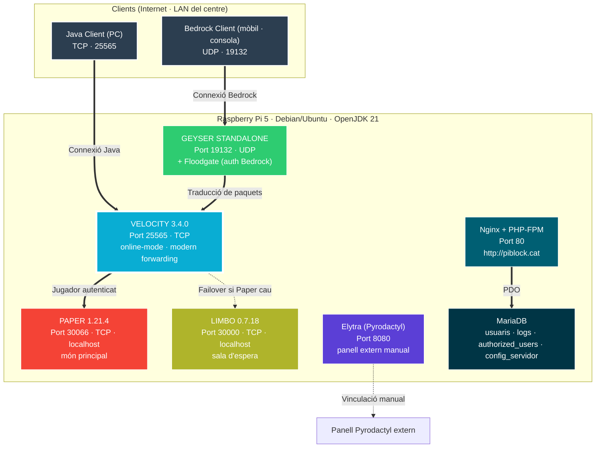

<div align="center">

# PiBlock


**Servidors Minecraft per a instituts: fàcil, ràpid i complet — Java i Bedrock al mateix món, sobre una Raspberry Pi 5.**

</div>

---

## 📌 Què és això?

**PiBlock** converteix una **Raspberry Pi 5** en un servidor de Minecraft preparat per a aules. Una sola comanda d'instal·lació desplega tot l'stack i deixa l'equip llest per acceptar jugadors de **Java** i **Bedrock** al mateix món. La gestió es fa des d'un panell web propi a `http://piblock.cat` i, opcionalment, des del panell **Pyrodactyl** extern via el *daemon* **Elytra** inclòs.

> 🟢 **Estat:** stack de joc 100 % operatiu via `install.sh`. Les parts pendents (provisió MariaDB automàtica, *backups* programats, registre automàtic de noves màquines, interfície del professor) es documenten més avall.

---

## 🏗️ Com funciona tècnicament



Cada servei té la seva pròpia unitat `systemd`: `piblock-velocity.service`, `piblock-paper.service`, `piblock-limbo.service`, `piblock-geyser.service` (tots amb `Restart=on-failure`) i `elytra.service`. Per a la xarxa: `nginx` + `php-fpm`, `mariadb`, `avahi-daemon` (mDNS per a `piblock.cat`).

---

## 📂 Estructura del repositori

```
PiBlock/
├── README.md
├── install.sh
├── config/
│   ├── paper/      # server.properties · spigot.yml · paper-global.yml · plugins/floodgate
│   ├── velocity/   # velocity.toml · plugins/floodgate
│   ├── geyser/     # config.yml
│   └── limbo/      # server.properties · spawn.schem · plugins/floodgate
├── web/            # Panell web PHP (pla, sense subdirs)
│   ├── login.php · register.php · dashboard.php · config.php
│   ├── admin_users.php · delete_users.php · logs.php
│   ├── auth.php · db.php · logout.php · style.css
└── docs/           # Memòria tècnica (PDF) i presentació bundled (HTML)
```

---

## 🚀 Instal·lació

> Cal Debian o Ubuntu (LTS recomanat) sobre la Raspberry Pi 5, sortida a Internet i accés `root`.

```bash
curl -sSL piblock.cat/install.sh | sudo bash
```

El script (`install.sh`, 605 línies) automatitza:

1. Detecció d'arquitectura (`amd64` / `arm64` / `armhf`) i comprovació de recursos.
2. Dependències: OpenJDK 21, Nginx, PHP-FPM, UFW, Avahi, `openssl`, `sqlite3`.
3. Docker (necessari per al *daemon* Elytra).
4. Descàrrega de **Paper 1.21.4 build 222**, **Velocity 3.4.0-SNAPSHOT build 469**, **Limbo 0.7.18**, **Geyser** *latest*.
5. *Plugins*: **Floodgate**, **Hurricane**, **PacketEvents 2.11.2-SNAPSHOT**, **GeyserExtras 2.0.0-BETA-11**.
6. **Elytra** (*daemon* Pyrodactyl) i **Rustic** (*backups* deduplicats + encriptats).
7. Usuari de sistema `pyrodactyl` (UID 8888) afegit al grup `docker`.
8. Generació de secrets: clau de *modern forwarding* per a Velocity i `key.pem` (EC P-384) per a Floodgate.
9. Unitats `systemd` `piblock-*` amb `Restart=on-failure` i firewall UFW (22, 80, 443, 25565/TCP, 19132/UDP, 8080).
10. Nginx servint `/var/www/piblock` a `http://piblock.cat`.
11. `avahi-daemon` (mDNS) anunciant `piblock` i `piblock.cat` a la xarxa local.
12. *Backup* inicial amb Rustic.

Comandes posteriors:

```bash
/opt/piblock/start_all.sh
/opt/piblock/stop_all.sh
systemctl status piblock-*
```

⚠ Elytra queda instal·lat però no configurat. Per vincular-lo a un panell Pyrodactyl extern:

```bash
cd /etc/elytra && elytra configure \
    --panel-url <URL_DEL_PANELL> --token <TOKEN> --node <NODE_ID>
systemctl enable --now elytra
```

---

## 🌐 Accés

| Servei | URL / Port | Visibilitat |
|---|---|---|
| Panell web propi | **http://piblock.cat** (port 80) | Internet (UFW) |
| Servidor Java | `piblock.cat:25565` | Internet (UFW) |
| Servidor Bedrock | `piblock.cat:19132/UDP` | Internet (UFW) |
| *Daemon* Elytra | `:8080` | Internet (UFW) |
| Paper (intern) | `:30066` | Només localhost |
| Limbo (intern) | `:30000` | Només localhost |

> El panell web fa servir **HTTP**, no HTTPS. La resolució `piblock.cat` a la xarxa local es fa via mDNS (`avahi-daemon`).

---

## 🖥️ Panell web (PHP)

- **Login PHP** amb `password_hash` (bcrypt) i sessions PHP.
- **PDO + prepared statements** a totes les consultes.
- **Tres rols** definits a `usuaris.rol`:
  - `admin` — gestió d'usuaris, logs, eliminacions.
  - `professor` — rol assignat per defecte al registre amb codi d'invitació.
  - `user` — rol bàsic creat manualment per un `admin`.

### Esquema de la base de dades

| Taula | Columnes | Propòsit |
|---|---|---|
| `usuaris` | `id`, `username`, `password_hash`, `rol` | Comptes i credencials |
| `authorized_users` | `id`, `username`, `invite_code`, `used` | Codis d'invitació |
| `logs` | `id`, `username`, `action`, `created_at` | Activitat |
| `config_servidor` | `clau`, `valor` | Dificultat, *gamemode*, *whitelist* |

---

## 📊 Estat del projecte

| Àrea | Estat |
|---|---|
| Stack Minecraft (Paper · Velocity · Geyser · Floodgate · Limbo) | ✅ Operatiu |
| Failover a Limbo | ✅ Operatiu |
| Java + Bedrock al mateix món | ✅ Operatiu |
| `install.sh` (*one-liner*) | ✅ Operatiu |
| *Backup* inicial amb Rustic | ✅ Operatiu |
| UFW + mDNS (`piblock.cat`) | ✅ Operatiu |
| Panell web (login · dashboard · config · admin · logs) | ✅ Operatiu |
| *Daemon* Elytra instal·lat | 🟡 Requereix vinculació manual a Pyrodactyl |
| Provisió automàtica de MariaDB + esquema | 🚧 En desenvolupament |
| *Backups* programats des de la web | 🚧 En desenvolupament |
| Registre automàtic de noves màquines | 🚧 En desenvolupament |
| Interfície educativa del professor (CU-07 / CU-08) | 🚧 En desenvolupament |

---

## 📚 Documentació i enllaços

- **Memòria tècnica (PDF)** — [`docs/PiBlock_Memoria_Tecnica.pdf`](docs/PiBlock_Memoria_Tecnica.pdf)
- **Presentació pública** — <https://uhcv.github.io/>
- **Panell web** — <http://piblock.cat>
- **Roadmap / Gantt (ClickUp)** — <https://app.clickup.com/90152331687/v/s/90159849084>

---

## 👥 Equip

Projecte intermodular del cicle **SMX2 · Mòdul M12** a l'**INS Palamós**, curs **2025-26**.

- **Mohamed Amin Adaardour** — Infraestructura · proxy · scripts
- **Diego Morazán** — Web PHP · documentació · repositori

Tutor: **Antonio Alcalà**

[](https://github.com/uhcv/PiBlock/graphs/contributors)

<div align="center">

<sub>Repositori: <a href="https://github.com/uhcv/PiBlock">uhcv/PiBlock</a></sub>

</div>
